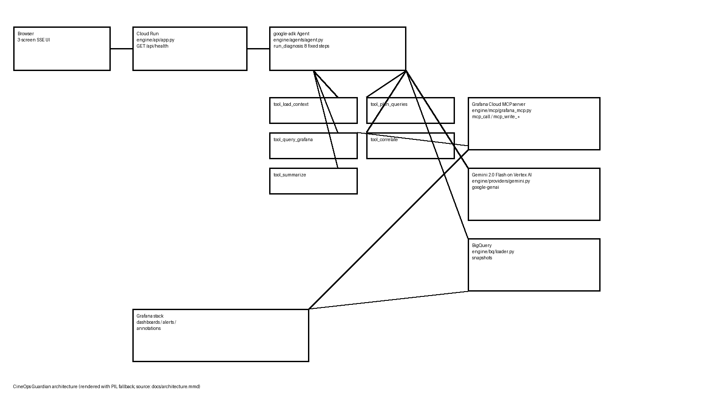

# CineOps Guardian

Post-production incident triage — plain-English questions answered with live Grafana telemetry.

**Partner track: Grafana Labs**

Powered by Gemini 2.0 Flash on Vertex AI + google-adk.

- Spin-up: [docs/SPINUP.md](docs/SPINUP.md)
- License: [LICENSE](LICENSE)

> Modification rule: the only pre-existing files ANY plan may modify are: `package.json`, `pyproject.toml`, `config/model-profiles.json`, `config/env.example`, `config/transport.json`, `config/deploy/provider.json`, `index.html`, `vite.config.ts`, `README.md`, `.gitignore`, and the `engine/**` TODO(ENGINE) stubs. All chassis `src/*` and `contracts/*` are read-only. Enforcement: `git diff --name-only` must show no other pre-existing path touched.

## Track

Partner track: Grafana Labs

## What it does

CineOps Guardian answers one incident question — which shots are blocked for
tomorrow's dailies and why — with live Grafana telemetry. A deterministic
8-step `google-adk` agent reads Grafana through the MCP server, correlates
evidence against call sheets + VFX delivery memos, persists snapshots to
BigQuery, and writes a dashboard annotation + incident note back only after
explicit human approval. The 3-screen SSE UI runs on Cloud Run.



## How it decides

Deterministic rules (`engine/diagnose/rules.py`, `DIAGNOSTIC_RULES`),
first match wins:

| rule | level |
|---|---|
| R-QUEUE sustained queue-latency breach | blocked |
| R-FAILRUN run of failed render jobs | high |
| R-FANOUT failed job with downstream dependants | blocked |
| R-ALERT firing alert matching vendor | high |
| R-INCIDENT open incident touching production | blocked |
| R-COMMIT commitment due inside window, shot unapproved | medium |
| R-TREND worsening 7-day trend | medium |
| R-OK healthy shot | ok |

Gemini 2.0 Flash on Vertex explains and cites — rules never defer judgment
to the model. Five ADK tools: `tool_load_context`, `tool_plan_queries`,
`tool_query_grafana`, `tool_correlate`, `tool_summarize`.

## Imported-and-called proof

(a) `google-adk` in `engine/agents/agent.py`:

```python
from google.adk.agents import Agent  # engine/agents/agent.py:13
_AGENT = Agent(  # engine/agents/agent.py:201
    model=build_adk_model(),  # engine/agents/agent.py:202 -> "gemini-2.0-flash"
```

(b) `google-genai` in `engine/providers/gemini.py`:

```python
from google.genai import Client  # engine/providers/gemini.py:12
resp = _client().models.generate_content(  # engine/providers/gemini.py:115
```

(c) Grafana MCP in `engine/mcp/grafana_mcp.py`:

```python
def mcp_call(tool: str, args: dict, *, kind: str) -> Any:  # engine/mcp/grafana_mcp.py:424
def mcp_write_annotation(action: RemediationAction) -> Any:  # engine/mcp/grafana_mcp.py:465
```

Live evidence values: model id `gemini-2.0-flash`; `mcp_health()` tool discovery
pending live stack credentials (see `engine/mcp/TOOLS.md`); every MCP call is
appended to `logs/mcp-grafana.jsonl`. No non-Google AI SDK is imported or
called anywhere (gate: `bash scripts/hygiene.sh`).

## Synthetic data

Call sheets + VFX delivery memos for NEON HOLLOW are synthetic fixtures (no
real studio data; every record watermarked `synthetic:true`, every memo first
line `SYNTHETIC DEMO DATA — NOT REAL`). Grafana telemetry is seeded by
`npm run seed:grafana`.

## Run it

See [docs/SPINUP.md](docs/SPINUP.md).

## License

Apache-2.0 — see [LICENSE](LICENSE).
