# CineOps Guardian — Grafana Labs track

> Demo deck (DP-DEMO). Slide 1 names the Grafana Labs track. Generated with
> `deckgen populate --no-llm` (offline/extractive; the chassis template set was
> absent so this file is hand-completed per DP-DEMO §6 step 1) + post-edits.

## 1. The problem

Meet Maya, post-production coordinator on NEON HOLLOW. Tomorrow's dailies are
blocked — the render queue is failing (incident window
2026-09-04T14:00:00Z → 2026-09-04T15:30:00Z, vendor HELIOSFORGE, from
`engine/rag/corpus/CORPUS.json`).

## 2. The product (live, not slides)

CineOps Guardian, live on Cloud Run (`PUBLIC_URL` in `docs/DEPLOY.md`): Maya
asks in plain English which shots are blocked for dailies, hits Diagnose, and
watches the 8 agent steps stream with per-MCP-call evidence cards.

## 3. How it decides

Deterministic `DIAGNOSTIC_RULES` (first match wins) + five ADK tools:

- R-QUEUE → blocked; R-FAILRUN → high; R-FANOUT → blocked; R-ALERT → high;
  R-INCIDENT → blocked; R-COMMIT → medium; R-TREND → medium; R-OK → ok.
- `tool_load_context`, `tool_plan_queries`, `tool_query_grafana`,
  `tool_correlate`, `tool_summarize` (`engine/agents/agent.py`).

Gemini 2.0 Flash on Vertex explains and cites — rules never defer judgment
to the model.

```mermaid
flowchart LR
    browser["Browser\n3-screen SSE UI"] --> run["Cloud Run\nengine/api/app.py\nGET /api/health"]
    run --> agent["google-adk Agent\nengine/agents/agent.py\nrun_diagnosis: 8 fixed steps"]
    agent --> t1["tool_load_context"]
    agent --> t2["tool_plan_queries"]
    agent --> t3["tool_query_grafana"]
    agent --> t4["tool_correlate"]
    agent --> t5["tool_summarize"]
    t3 --> mcp["Grafana Cloud MCP server\nengine/mcp/grafana_mcp.py\nmcp_call / mcp_write_*"]
    agent --> gem["Gemini 2.0 Flash on Vertex AI\nengine/providers/gemini.py\ngoogle-genai"]
    agent --> bq["BigQuery\nengine/bq/loader.py\nsnapshots"]
    mcp --> graf["Grafana stack\ndashboards / alerts /\nannotations"]
    bq --> graf
```

(full source: `deck/diagram.mmd`)

## 4. Proof it is live

- Run screen: every evidence card names the MCP tool + row count.
- `GET /api/health`: Gemini reachable on Vertex, live MCP tool list,
  BigQuery reachable, cost block — plus a Cloud Run logs tail.
- `logs/mcp-grafana.jsonl`: one JSON line per MCP call (`path: mcp`).

## 5. The write-back (approved, then applied)

Maya approves — the annotation is written back to Grafana (VARIANT-B wording;
VARIANT-A "written through MCP" only when `WriteReceipt.path == "mcp"`).
Before/after dashboard: `cineops-render-queue`, panel 1.

## 6. Outcome

Blocked shots reprioritised with cited findings — hours of coordinator triage
saved (`totals.hours_saved` on the result screen).

## 7. Close

Deterministic rules decide; the model explains — built for the Grafana Labs
track.
